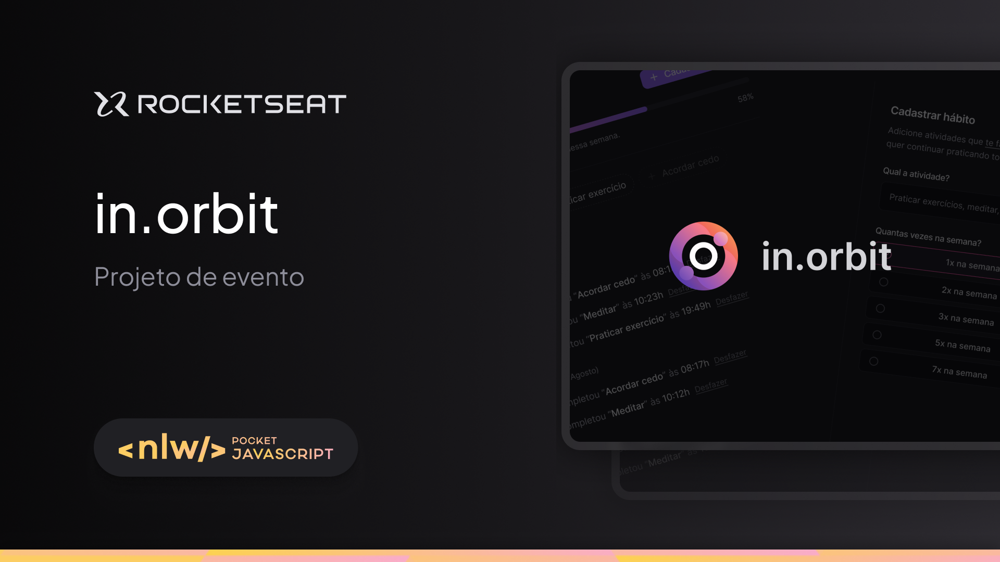

<h1 align="center"> Projeto NLW Pocket - JavaScript 🚀 </h1>

 Programa exclusivo e gratuito, promovido pela Rocketseat para ensino de tecnologias WEB

  <a href="#-projeto">Projeto</a>&nbsp;&nbsp;&nbsp;|&nbsp;&nbsp;&nbsp;
  <a href="#-tecnologias">Tecnologias</a>&nbsp;&nbsp;&nbsp;|&nbsp;&nbsp;&nbsp;
  <a href="#-aprendizado">Aprendizado</a>&nbsp;&nbsp;&nbsp;|&nbsp;&nbsp;&nbsp;
  <a href="#-layout">Layout</a>&nbsp;&nbsp;&nbsp;|&nbsp;&nbsp;&nbsp;

  

  

## 📃 Projeto

Durante o evento, construímos uma aplicação web interativa, desenvolvida para demonstrar o poder do JavaScript em criar interfaces dinâmicas e escaláveis. Este projeto integra as seguintes funcionalidades:

- Manipulação eficiente de dados no front-end.
- Integração com uma API externa para exibição de informações dinâmicas.
- Uso de boas práticas em estruturação de código e organização de pastas.

O programa é um Gerenciador de Metas, que permite cadastrar e acompanhar suas metas para execução em um período de 1 a 7 dias da semana. Você pode registrar suas metas e, ao completá-las, os dados são automaticamente salvos no banco de dados. Além disso, o sistema exibe de forma clara todas as metas pendentes e as já realizadas, facilitando o acompanhamento do seu progresso.
  
## 🧑‍💻 Tecnologias

Esse projeto foi desenvolvido com as seguintes tecnologias:

### Backend 
- [Node.js](https://nodejs.org/): Ambiente de execução para JavaScript no servidor.
- [Fastify](https://www.fastify.io/): Framework web focado em performance para construção de APIs.
- [Drizzle ORM](https://orm.drizzle.team/): Ferramenta para interação com o banco de dados.
- [PostgreSQL](https://www.postgresql.org/): Banco de dados relacional utilizado.
- [Zod](https://zod.dev/): Biblioteca de validação de esquemas e tipos.
- [Day.js](https://www.npmjs.com/package/dayjs): Manipulação de datas de forma simples e leve.
- [TypeScript](https://www.typescriptlang.org/): Superset de JavaScript que adiciona tipagem estática.
- [Tsup](https://www.npmjs.com/package/tsup): Bundler para empacotar o código TypeScript.

### Frontend
- [React](https://react.dev): Biblioteca JavaScript para construção de interfaces de usuário.
- [React Hook Form](https://react-hook-form.com): Gerenciamento de formulários no React.
- [Radix UI](https://www.radix-ui.com): Componentes acessíveis para a web.
- [React Query](https://tanstack.com/query/v5): Gerenciamento de estado assíncrono no React.
- [Tailwind CSS](https://tailwindcss.com): Framework utilitário para estilização rápida.
- [Vite](https://vitejs.dev): Ferramenta de build rápida para projetos front-end.

## 📘 Aprendizado

Durante o desenvolvimento deste projeto aprendi a aplicar diversas práticas e tecnologias modernas no front-end e back-end. Entre os principais aprendizados estão:

- Integração com APIs: Aprimorei meu conhecimento em consumo de APIs e apliquei boas práticas de programação para otimizar esse processo. A utilização de novas e variadas tecnologias me proporcionou uma visão mais clara sobre
 como desenvolver e configurar APIs."
- Validação com Zod: O Zod foi uma ferramenta nova para mim até este evento. Aprendi a importância de realizar validações para tornar o código mais limpo e sua execução mais robusta.
- Gerenciamento de estado com React Query: Compreendi como gerenciar o estado assíncrono de forma otimizada, utilizando o React Query para lidar com requisições e cache.
- Estilização com Tailwind CSS: Aprendi a criar layouts responsivos e modularizados com classes utilitárias, acelerando o processo de design.
- Organização de código: Apliquei boas práticas de estruturação de código, dividindo responsabilidades e utilizando TypeScript para melhorar a manutenibilidade e clareza do código.

## 😄 Layout

Você pode visualizar o layout do projeto através [DESSE LINK](https://www.figma.com/design/9ARwnovZOppPVwWneutatW/NLW-Pocket-JS-%E2%80%A2-in.orbit-(Community)?node-id=2001-336&t=XQxVtXpqvOw0DI6i-1). É necessário ter conta no [Figma](https://figma.com) para acessá-lo.

## :memo: Licença

Esse projeto está sob a licença MIT.

---

Feito com ♥ by Ítalo César :wave: 
